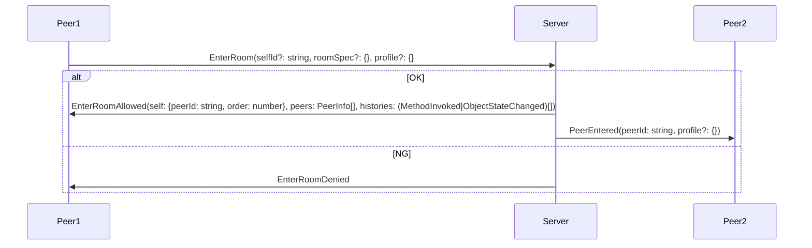
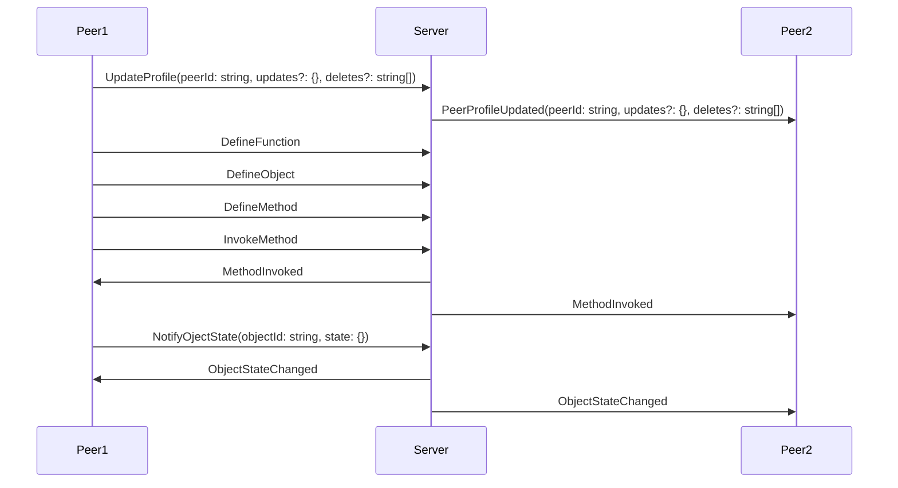
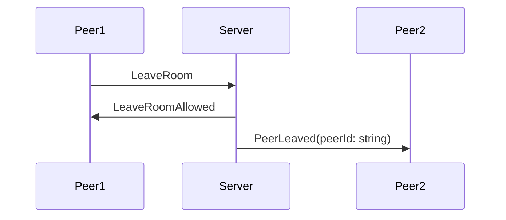
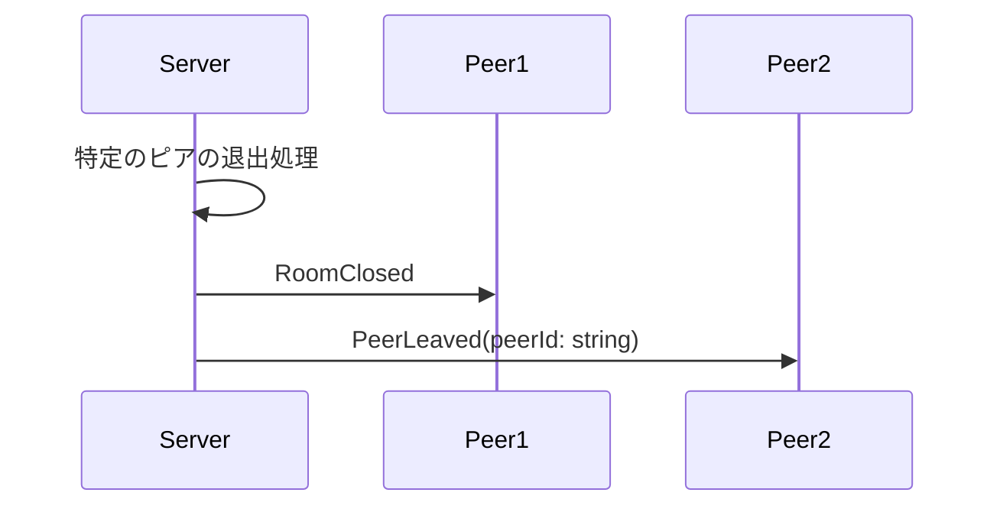
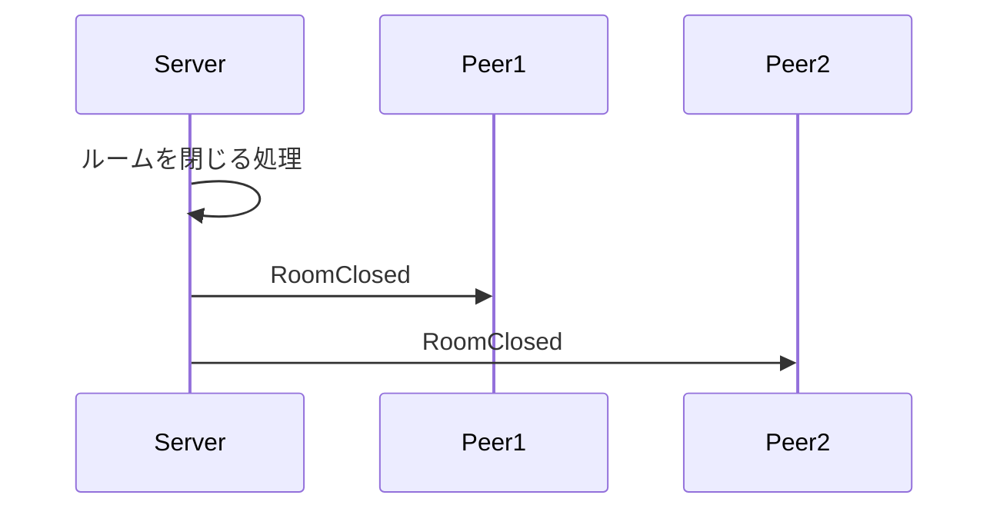

# madoi-core

分散共有オブジェクトフレームワーク 'madoi' のコア部分。メッセージ配信処理のみを実装。

## 用語
|用語|説明|
|---|---|
|メッセージ(Message)|クライアントやサーバ間でやりとりされるデータ。JSON形式|
|ルーム(Room)|ピアが参加する、メッセージ配信の区切りとなるグループ。メッセージ配信はルーム内で完結する。|
|ピア(Peer)|クライアントを識別する単位。IDとプロファイル(name=valueのセット)を持ち、ルームに参加してメッセージ通信を行う|

## メッセージシーケンス

### 入室時

### 入室後

### 退室時

