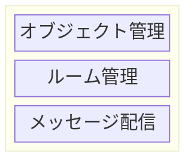
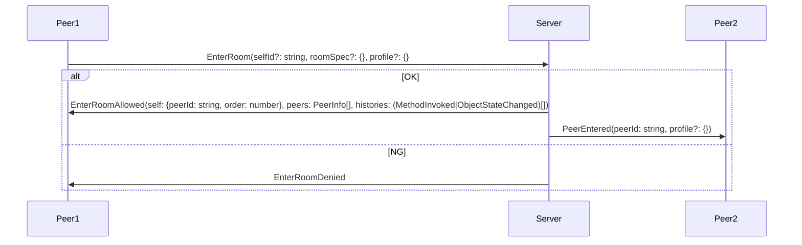
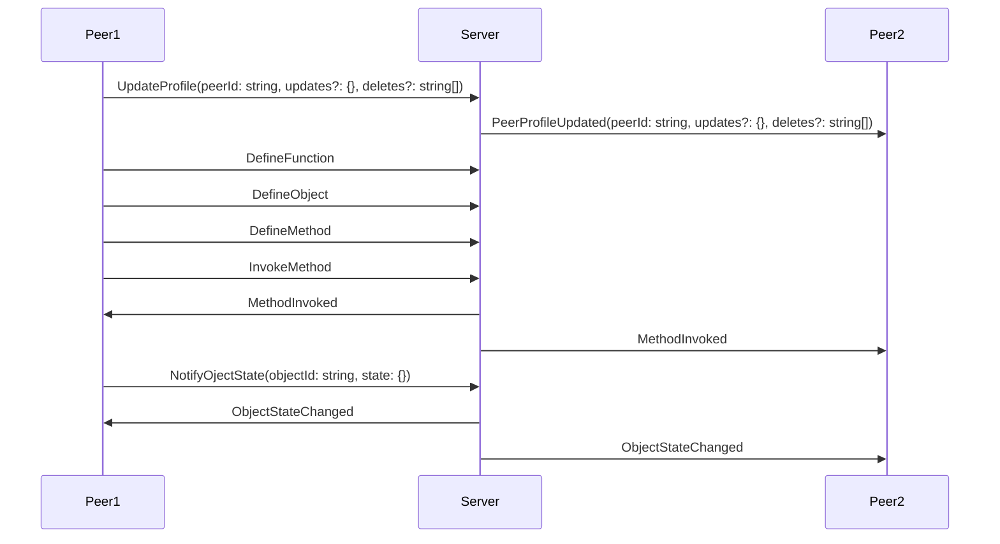
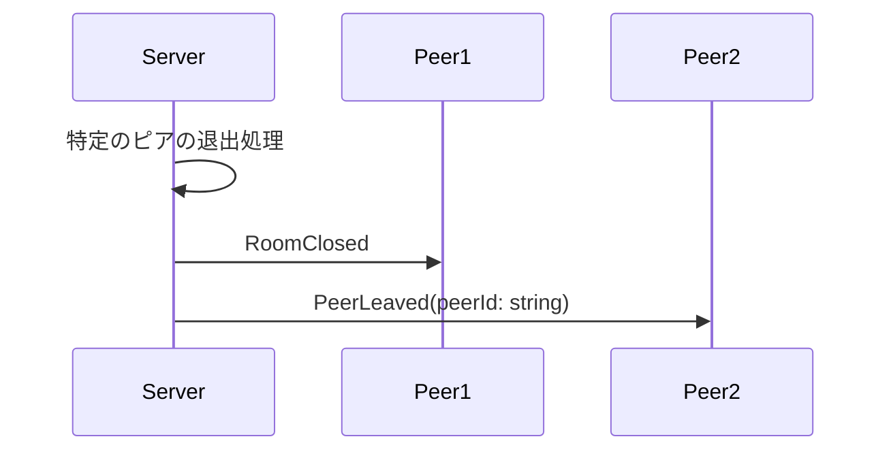
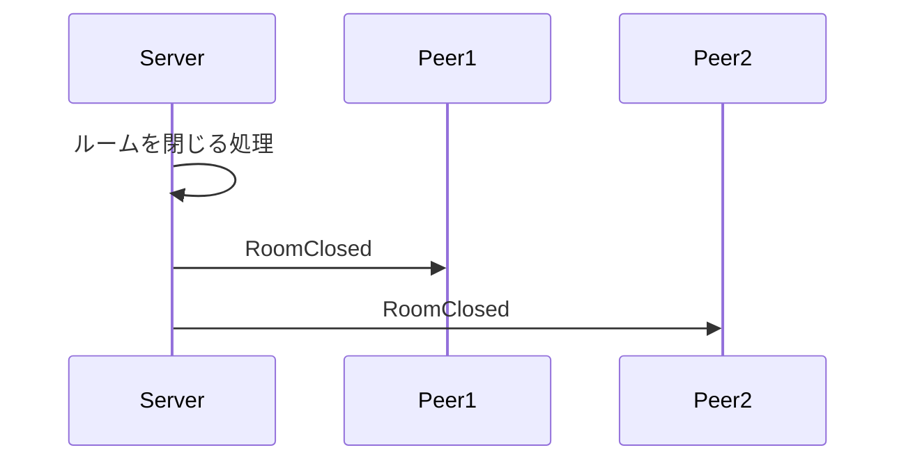

# Madoi - an Open Source Messaging Server for Collaboration Tools

Madoiは、コラボレーションツール用のオープンソースメッセージングサーバーです。"Madoi" は、親しい人が集まって語らい楽しい時間を過ごす "円居"、と、多人数が参加するコラボレーションツールを実現するための複雑なプログラミングに苦悩する開発者の'惑い'、の両方を意味しています。

Madoiは、サーバーレスのコラボレーションツール開発を目指して設計されています。Madoiを利用することで、サーバ側のプログラミング無しに、コラボレーションツールを開発できます。

## 機能概要

Madoiは、ルーム内でのメッセージ配信機能を実装したメッセージ配信と、ルームの管理機能を実装したルーム管理、クライアントアプリケーション内のオブジェクトの同期を実現するためのオブジェクト管理の3つのレイヤから構成されています。メッセージ配信およびルーム管理の機能だけでメッセージ配信サーバとして利用可能ですが、オブジェクト管理の機能を利用することで、より効率的にコラボレーション機能を開発できます。



* メッセージ配信
  * このレイヤでは、一斉送信(Broadcast)や個別送信(Unicast, Multicast)などのメッセージ配信機能が提供されます。
* ルーム管理
  * このレイヤでは、参加者の入退室管理や、メッセージ履歴の管理機能が提供されます。
* オブジェクト管理
  * このレイヤでは、クライアントアプリケーション内のオブジェクトの状態や変更の管理機能が提供されます。

## 使い方

### メッセージの配信

Madoiを使った最もシンプルな例を以下に示します。この例では、Webページが表示されたらMadoiサーバに接続します。
その後ウィンドウがクリックされたらメッセージをサーバに送信し、サーバからメッセージが送信されてくれば、Webページにdivタグを追加します。
この例をファイルに保存して、それを複数のブラウザで開くと、一つのブラウザでウィンドウがクリックされるたびに、全てのブラウザにdivタグが追加されます。

### tutorial01.html
```html
<html>
<head>
<meta charset="utf8">
</head>
<body>
<script src="http://localhost:8080/madoi/js/madoi.js"></script>
<script>
window.addEventListener("load", ()=>{
  // Madoiクライアントを作成しサーバに接続する。
  // 引数はルームのIDとAPI KEY。
  const m = new madoi.Madoi("chat-ldfngslkkeg?apikey=XXXXXXXXX");

  // ウィンドウがクリックされたら、メッセージをサーバに送信する。
  // サーバは同じルームに接続している全てのブラウザにメッセージを送信する。
  window.addEventListener("click", e=>{
    // 第一引数はメッセージタイプ。第二引数はメッセージ内容(body)
    m.send("windowClicked", "hello");
  });

  // "windowClick"タイプのメッセージを受信したら、documentにdivタグを追加する。
  m.addReceiver("windowClicked", ({detail: {body}})=>{
    const div = document.createElement("div");
    div.innerText = body;
    document.body.append(div);
  });
});
</script>
</body>
</html>
```

Madoiでのメッセージ配信は、デフォルトではブロードキャスト(自身も含めルーム内の全ての参加者にメッセージを送信)です。sendメソッドを呼び出すと、引数に渡したタイプ(1番目の引数。文字列)、内容(2番目の引数。任意のオブジェクト)がブロードキャストされます。この際、内容はJSON.stringifyメソッドを使用してJSONに変換されてから送信されます。

メッセージの受信は、特定のタイプのメッセージを受け取る関数をaddReceiverメソッドで登録します。登録したタイプのメッセージを受信すると、関数が呼び出され、引数にイベントオブジェクトが渡されます。

渡されるイベントオブジェクトの概要を以下に示します(実際にはより多くの情報が含まれていますが、ここでは最小限のものを示しています)。

```TypeScript
{
  currentTarget: Madoi,
  detail: {
    type: string;
    body: any;
  }
}
```

イベントオブジェクトのcurrentTargetは常にMadoiのインスタンスになります。detailにメッセージの詳細が含まれており、typeにsendメソッドの最初の引数に渡した文字列、bodyに2番目の引数に渡した値が含まれています(正確には、送信時にJSON.stringifyでJSONにエンコーディングされ、受信時にJSON.parseでオブジェクトに戻された値です)。

タイプには任意の文字列が指定できますが、Madoiが内部で使用している、次の文字列は使用できません。

* EnterRoom
* EnterRoomAllowed
* EnterRoomDenied
* Leaveroom
* LeaveRoomDone
* UpdateRoomProfile
* PeerEntered
* PeerLeaved
* UpdatePeerProfile
* DefineFunction
* DefineObject
* InvokeFunction
* InvokeMethod
* UpdateObjectState
* Error


### 関数実行の共有


## 用語
|用語|説明|
|---|---|
|メッセージ(Message)|クライアントやサーバ間でやりとりされるデータ。JSON形式|
|ルーム(Room)|ピアが参加する、メッセージ配信の区切りとなるグループ。メッセージ配信はルーム内で完結する。|
|ピア(Peer)|クライアントを識別する単位。IDとプロファイル(name=valueのセット)を持ち、ルームに参加してメッセージ通信を行う|

## メッセージシーケンス

### 入室時


### 入室後


### 退室時




