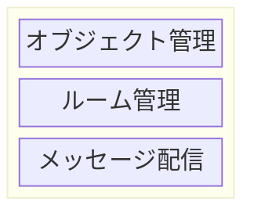

# Madoi - an Open Source Messaging Server for Collaboration Tools

Madoiは、コラボレーションツール用のメッセージングサーバーです。通信にはWebsocketを使用しています。"Madoi" という名前は、親しい人が集まって語らい楽しい時間を過ごす "円居"、と、多人数が参加するコラボレーションツールを実現するための複雑なプログラミングに苦悩する開発者の"惑い"、の両方を意味しています。

Madoiは、サーバーレスのコラボレーションツール開発を目指して設計されています。Madoiを利用することで、サーバ側のプログラミング無しに、コラボレーションツールを開発できます。

## 機能概要

Madoiは、ルーム内でのメッセージ配信機能を実装したメッセージ配信と、ルームの管理機能を実装したルーム管理、クライアントアプリケーション内のオブジェクトの同期を実現するためのオブジェクト管理の3つのレイヤから構成されています。メッセージ配信およびルーム管理の機能だけでメッセージ配信サーバとして利用可能ですが、オブジェクト管理の機能を利用することで、より効率的にコラボレーション機能を開発できます。



* メッセージ配信
  * このレイヤでは、一斉送信(Broadcast)や個別送信(Unicast, Multicast)などのメッセージ配信機能が提供されます。
* ルーム管理
  * このレイヤでは、参加者の入退室管理や、メッセージ履歴の管理機能が提供されます。
* オブジェクト管理
  * このレイヤでは、クライアントアプリケーション内のオブジェクトの状態や変更の管理機能が提供されます。

## サーバの起動方法

Madoiプロジェクトでは、メモリ上で動作する(ファイルやDBに情報を残さない)madoi-volatileserverを提供しています。
このリポジトリをcloneしてdockerコマンドを実行すると、ローカルでサーバが起動します。

まず、このリポジトリをcloneしてください。

```bash
git clone https://github.com/kcg-edu-future-lab/madoi
```

次にcloneしたディレクトリないで、docker-composeコマンドを実行してください。

```bash
cd madoi
docker compose up
```

コマンドを実行すると、Madoiのビルドが行われ、volatileserverが起動します。

```bash
> docker compose up
[+] Running 1/0
 ✔ Container madoi-madoi_volatileserver-1  Created                                                                                          0.0s 
Attaching to madoi_volatileserver-1
madoi_volatileserver-1  |   .   ____          _            __ _ _
madoi_volatileserver-1  |  /\\ / ___'_ __ _ _(_)_ __  __ _ \ \ \ \
madoi_volatileserver-1  | ( ( )\___ | '_ | '_| | '_ \/ _` | \ \ \ \
madoi_volatileserver-1  |  \\/  ___)| |_)| | | | | || (_| |  ) ) ) )
madoi_volatileserver-1  |   '  |____| .__|_| |_|_| |_\__, | / / / /
madoi_volatileserver-1  |  =========|_|==============|___/=/_/_/_/
madoi_volatileserver-1  | 
madoi_volatileserver-1  |  :: Spring Boot ::                (v3.3.0)
madoi_volatileserver-1  | 
(省略)
madoi_volatileserver-1  | 2024-06-16T14:20:06.153Z  INFO 7 --- [           main] o.s.b.w.embedded.tomcat.TomcatWebServer  : Tomcat started on port 8080 (http) with context path '/madoi'
madoi_volatileserver-1  | 2024-06-16T14:20:06.170Z  INFO 7 --- [           main] e.k.f.madoi.volatileserver.Application   : Started Application in 3.427 seconds (process running for 3.999)
```

`Start Application`と出力されると、サーバが起動しています。この状態で `http://localhost:8080/madoi/chat_message.html` にブラウザでアクセスすると、チャットサンプルが表示されます。


## クライアントライブラリの使い方

### メッセージの配信

Madoiを使った最もシンプルな例を以下に示します。この例では、Webページが表示される(windowのloadイベントが発生する)とMadoiサーバに接続します。
テキストボックスに文字が入力されenterキーが押されたら、入力内容をサーバに送信し、サーバからメッセージが送信されてくれば、入力内容を含んだdivタグを追加します。
この例をファイルに保存して、それを複数のブラウザで開くと、送信した内容が全てのブラウザに送られ、divタグが追加されます。

[chat_by_sendrecv.html](madoi-volatileserver/webapp/chat_by_sendrecv.html)
```html
<!DOCTYPE html>
<html lang="ja">
<head>
<meta charset="utf-8">
<style>
div#log{
  border: 1px solid;
  border-radius: 4px;
  min-height: 300px;
}
</style>
<script src="http://localhost:8080/madoi/js/madoi.js"></script>
</head>
<body>
<form id="form">
  <label>message:
    <input id="input" type="text" class="form-control" placeholder="enter to send">
  </label>
  <div id="log"></div>
</form>
<script>
window.addEventListener("load", ()=>{
  // Madoiクライアントを作成しサーバに接続する。
  // 引数は任意のルームIDとAPI KEY。
  const m = new madoi.Madoi("chat_by_sendrecv_sdkfj2j?apikey=ahfuTep6ooDi7Oa4");

  // フォームのsubmit時に、メッセージを送信する。
  document.getElementById("form").addEventListener("submit", e=>{
    e.preventDefault();
    const input = document.getElementById("input");
    // メッセージのブロードキャスト。
    // 引数はメッセージタイプとメッセージ内容(body)
    m.send("chat", input.value)
    input.value = "";
  });
  // レシーバの登録。引数はタイプとレシーバ。
  // レシーバのパラメータはCustomEvent型で、detailのbodyに送信内容が格納されている。
  m.addReceiver("chat", ({detail: {body}})=>{
    document.getElementById("log").innerHTML += `<div>${body}</div>\n`;
  });
});
</script>
</body>
</html>
```

Madoiでのメッセージ配信は、デフォルトではブロードキャスト(自身も含めルーム内の全ての参加者にメッセージを送信)です。sendメソッドを呼び出すと、引数に渡したタイプ(1番目の引数。文字列)、内容(2番目の引数。任意のオブジェクト)がブロードキャストされます。この際、内容はJSON.stringifyメソッドを使用してJSONに変換されてから送信されます。

メッセージの受信は、特定のタイプのメッセージを受け取る関数をaddReceiverメソッドで登録します。登録したタイプのメッセージを受信すると、関数が呼び出され、引数にイベントオブジェクトが渡されます。

渡されるイベントオブジェクトの概要を以下に示します(実際にはより多くの情報が含まれていますが、ここでは最小限のものを示しています)。

```TypeScript
{
  currentTarget: Madoi,
  detail: {
    type: string;
    body: any;
  }
}
```

イベントオブジェクトのcurrentTargetは常にMadoiのインスタンスになります。detailにメッセージの詳細が含まれており、typeにsendメソッドの最初の引数に渡した文字列、bodyに2番目の引数に渡した値が含まれています(正確には、送信時にJSON.stringifyでJSONにエンコーディングされ、受信時にJSON.parseでオブジェクトに戻された値です)。

タイプには任意の文字列が指定できますが、Madoiが内部で使用している、次の文字列は使用できません。

* EnterRoom
* EnterRoomAllowed
* EnterRoomDenied
* Leaveroom
* LeaveRoomDone
* UpdateRoomProfile
* PeerEntered
* PeerLeaved
* UpdatePeerProfile
* DefineFunction
* DefineObject
* InvokeFunction
* InvokeMethod
* UpdateObjectState
* Error

### 関数実行の共有

Madoiでは多人数参加型のツールの開発に必要なメッセージ配信機能が用意されています。さらに、このメッセージ配信機能を利用した、オブジェクトの状態や関数の実行を共有する機能を提供しています。この機能を使うと、メッセージをどのようにやりとりするかはMadoiに任せて、関数やオブジェクトをどう共有するかを意識してプログラミングが行えます。

実際に例を見てみましょう。以下に示すコードは、先ほど実装したチャットを書き換えたものです。チャットログにメッセージを追加する部分が関数(chat)として切り出され、Madoiを使ってその関数の実行を共有するというスタイルに変わっています。

[chat_by_function.html](madoi-volatileserver/webapp/chat_by_function.html)
```html
<!DOCTYPE html>
<html lang="ja">
<head>
<meta encoding="utf-8">
<script src="./js/madoi.js"></script>
<style>
div#log{
  border: 1px solid;
  border-radius: 4px;
  min-height: 300px;
}
</style>
</head>
<body>
<form id="form">
  <label>message:
    <input id="input" type="text" class="form-control" placeholder="enter to send">
  </label>
  <div id="log"></div>
</form>
<script>
window.addEventListener("load", ()=>{
  // Madoiクライアントを作成しサーバに接続する。
  // 引数は任意のルームIDとAPI KEY。
  const m = new madoi.Madoi("chat_by_function_sdkfj2j?apikey=ahfuTep6ooDi7Oa4");

  // メッセージの追加処理を実装した関数。
  let chat = function(message){
    document.getElementById("log").innerHTML += message + "<br />";
  };

  // 関数をmadoiに登録する。戻り値は、本来のchat関数の代わりに使用する関数。
  // 呼び出すと、呼び出されたことをBroadcastする。
  // 内部でレシーバも用意されており、サーバからBroadcastが来れば、本来の関数が呼び出される。
  chat = m.registerFunction(chat, {share: {maxLog: 1000}});

  // フォームのsubmit時に、chat関数を呼び出す。
  document.getElementById("form").addEventListener("submit", e=>{
    e.preventDefault();
    const input = document.getElementById("input");
    chat(input.value);
    input.value = "";
  });
});
</script>
</body>
</html>
```

共有したい処理を関数に切り出し、それをMadoiに登録し、以降は登録時に返された関数を実行するたびに、
同じルームに参加している全てのピアで、その関数が実行されるようになります。
登録時に返された関数を実行した際には、実際には本来の関数は実行されず、サーバへのメッセージ送信のみが行われます。
その後サーバからメッセージが全てのピアに送信され、ピアでそれを受信した際に、本来の関数が実行されます。
この振る舞いにより、全てのピアで同じ順番で関数が実行されるため、各ピアの状態が同期されやすくなります
(本来の関数内で乱数を利用していたり、共有すべき関数が登録されていないなど、同期が保たれない状況は複数あり得るため、
"同期されやすくなる"という表現にとどめます)。


