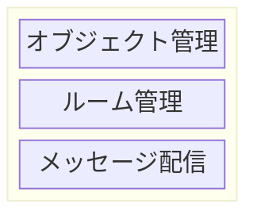
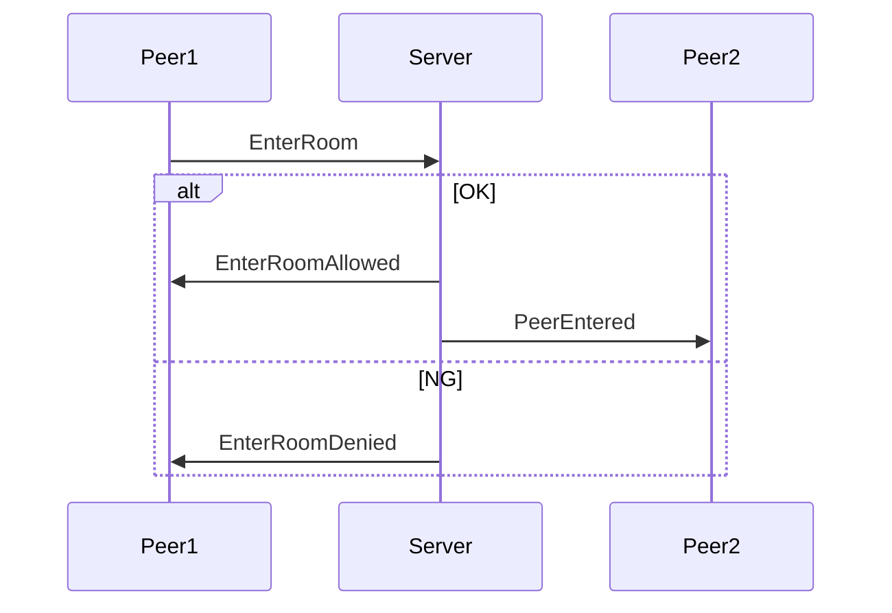
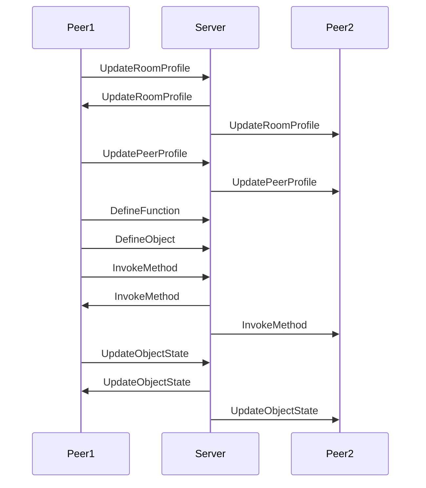
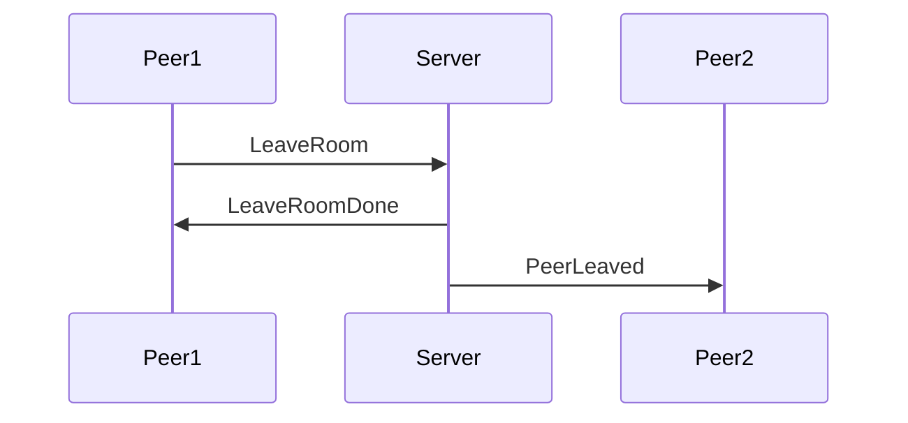

# Madoi - an Open Source Messaging Server for Collaboration Tools

Madoiは、コラボレーションツール用のメッセージングサーバーです。通信にはWebsocketを使用しています。"Madoi" という名前は、親しい人が集まって語らい楽しい時間を過ごす "円居"、と、多人数が参加するコラボレーションツールを実現するための複雑なプログラミングに苦悩する開発者の"惑い"、の両方を意味しています。

Madoiは、サーバーレスのコラボレーションツール開発を目指して設計されています。Madoiを利用することで、サーバ側のプログラミング無しに、コラボレーションツールを開発できます。

## 機能概要

Madoiは、ルーム内でのメッセージ配信機能を実装したメッセージ配信と、ルームの管理機能を実装したルーム管理、クライアントアプリケーション内のオブジェクトの同期を実現するためのオブジェクト管理の3つのレイヤから構成されています。メッセージ配信およびルーム管理の機能だけでメッセージ配信サーバとして利用可能ですが、オブジェクト管理の機能を利用することで、より効率的にコラボレーション機能を開発できます。



* メッセージ配信
  * このレイヤでは、一斉送信(Broadcast)や個別送信(Unicast, Multicast)などのメッセージ配信機能が提供されます。
* ルーム管理
  * このレイヤでは、参加者の入退室管理や、メッセージ履歴の管理機能が提供されます。
* オブジェクト管理
  * このレイヤでは、クライアントアプリケーション内のオブジェクトの状態や変更の管理機能が提供されます。

## 使い方

### メッセージの配信

Madoiを使った最もシンプルな例を以下に示します。この例では、Webページが表示されたらMadoiサーバに接続します。
テキストボックスに文字が入力されenterキーが押されたら、入力内容をサーバに送信し、サーバからメッセージが送信されてくれば、入力内容を含んだdivタグを追加します。
この例をファイルに保存して、それを複数のブラウザで開くと、送信した内容が全てのブラウザに送られ、divタグが追加されます。

`chat_by_sendrecv.html`
```html
<!DOCTYPE html>
<html lang="ja">
<head>
<meta encoding="utf-8">
<style>
div#log{
  border: 1px solid;
  border-radius: 4px;
  min-height: 300px;
}
</style>
<script src="./js/madoi.js"></script>
</head>
<body>
<form id="form">
  <label>message:
    <input id="input" type="text" class="form-control" placeholder="enter to send">
  </label>
  <div id="log"></div>
</form>
<script>
window.addEventListener("load", ()=>{
  // Madoiクライアントを作成しサーバに接続する。
  // 引数は任意のルームIDとAPI KEY。
  const m = new madoi.Madoi("chat_by_sendrecv_sdkfj2j?apikey=SheiYo8cohg0quei");

  // フォームのsubmit時に、メッセージを送信する。
  document.getElementById("form").addEventListener("submit", e=>{
    e.preventDefault();
    const input = document.getElementById("input");
    // メッセージのブロードキャスト。
    // 引数はメッセージタイプとメッセージ内容(body)
    m.send("chat", input.value)
    input.value = "";
  });
  // レシーバの登録。引数はタイプとレシーバ。
  // レシーバのパラメータはCustomEvent型で、detailのbodyに送信内容が格納されている。
  m.addReceiver("chat", ({detail: {body}})=>{
    document.getElementById("log").innerHTML += body + "<br />";
  });
});
</script>
</body>
</html>
```

Madoiでのメッセージ配信は、デフォルトではブロードキャスト(自身も含めルーム内の全ての参加者にメッセージを送信)です。sendメソッドを呼び出すと、引数に渡したタイプ(1番目の引数。文字列)、内容(2番目の引数。任意のオブジェクト)がブロードキャストされます。この際、内容はJSON.stringifyメソッドを使用してJSONに変換されてから送信されます。

メッセージの受信は、特定のタイプのメッセージを受け取る関数をaddReceiverメソッドで登録します。登録したタイプのメッセージを受信すると、関数が呼び出され、引数にイベントオブジェクトが渡されます。

渡されるイベントオブジェクトの概要を以下に示します(実際にはより多くの情報が含まれていますが、ここでは最小限のものを示しています)。

```TypeScript
{
  currentTarget: Madoi,
  detail: {
    type: string;
    body: any;
  }
}
```

イベントオブジェクトのcurrentTargetは常にMadoiのインスタンスになります。detailにメッセージの詳細が含まれており、typeにsendメソッドの最初の引数に渡した文字列、bodyに2番目の引数に渡した値が含まれています(正確には、送信時にJSON.stringifyでJSONにエンコーディングされ、受信時にJSON.parseでオブジェクトに戻された値です)。

タイプには任意の文字列が指定できますが、Madoiが内部で使用している、次の文字列は使用できません。

* EnterRoom
* EnterRoomAllowed
* EnterRoomDenied
* Leaveroom
* LeaveRoomDone
* UpdateRoomProfile
* PeerEntered
* PeerLeaved
* UpdatePeerProfile
* DefineFunction
* DefineObject
* InvokeFunction
* InvokeMethod
* UpdateObjectState
* Error

### 関数実行の共有

Madoiでは多人数参加型のツールの開発に必要なメッセージ配信機能が用意されていますが、メッセージの送受信ではなく、オブジェクトや関数の共有に着目した機能を備えています。この機能を使うと、関数やオブジェクトを共有することを意識したプログラミングが行えます。

実際に例を見てみましょう。以下に示すコードは、先ほど実装したチャットを、チャットログにメッセージを追加する関数(chat)と、その関数の共有で書き換えたものです。

`chat_by_function.html`
```html
<!DOCTYPE html>
<html lang="ja">
<head>
<meta encoding="utf-8">
<script src="./js/madoi.js"></script>
<style>
div#log{
  border: 1px solid;
  border-radius: 4px;
  min-height: 300px;
}
</style>
</head>
<body>
<form id="form">
  <label>message:
    <input id="input" type="text" class="form-control" placeholder="enter to send">
  </label>
  <div id="log"></div>
</form>
<script>
window.addEventListener("load", ()=>{
  // Madoiクライアントを作成しサーバに接続する。
  // 引数は任意のルームIDとAPI KEY。
  const m = new madoi.Madoi("chat_by_function_sdkfj2j?apikey=SheiYo8cohg0quei");

  // メッセージの追加処理を実装した関数。
  let chat = function(message){
    document.getElementById("log").innerHTML += message + "<br />";
  };

  // 関数をmadoiに登録する。戻り値は、本来のchat関数の代わりに使用する関数。
  // 呼び出すと、呼び出されたことをBroadcastする。
  // 内部でレシーバも用意されており、サーバからBroadcastが来れば、本来の関数が呼び出される。
  chat = m.registerFunction(chat, {share: {maxLog: 1000}});

  // フォームのsubmit時に、chat関数を呼び出す。
  document.getElementById("form").addEventListener("submit", e=>{
    e.preventDefault();
    const input = document.getElementById("input");
    chat(input.value);
    input.value = "";
  });
});
</script>
</body>
</html>
```


## 用語
|用語|説明|
|---|---|
|メッセージ(Message)|クライアントやサーバ間でやりとりされるデータ。JSON形式|
|ルーム(Room)|ピアが参加する、メッセージ配信の区切りとなるグループ。メッセージ配信はルーム内で完結する。|
|ピア(Peer)|クライアントを識別する単位。IDとプロファイル(name=valueのセット)を持ち、ルームに参加してメッセージ通信を行う|

## メッセージシーケンス

### 入室時


### 入室後


### 退室時


