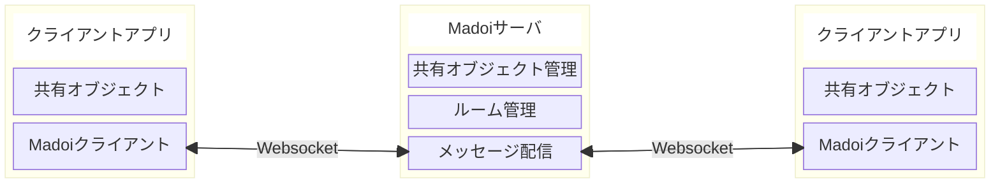

# Madoi - a Distributed Information Sharing Infrastructure for Serverless Development of Collaboration Tools

Madoiは、分散共有アプリケーション用の通信基盤です。チャットやホワイトボードなどのコラボレーションツールを宣言的に作成できます。通信にはWebsocketを使用しており、状態の共有やオブジェクトへの変更操作が、同じセッションに参加しているアプリケーションに通知されます。

"Madoi" という名前は、親しい人が集まって語らい楽しい時間を過ごす "円居"、と、多人数が参加するコラボレーションツールを実現するための複雑なプログラミングに苦悩する開発者の"惑い"、の両方を意味しています。

Madoiは、サーバーレスのコラボレーションツール開発基盤を目指して設計されています。Madoiを利用することで、アプリケーション側での通信のためのプログラミングや、サーバ側でのメッセージ配信や状態管理のためのプログラミング無しに、コラボレーションツールを開発できます。


## 関連リポジトリ

* [madoi-client-ts-js](https://github.com/kcg-edu-future-lab/madoi-client-ts-js)
  * MadoiのTypeScript/JavaScript向けクライアントライブラリ
* [madoi-client-react](https://github.com/kcg-edu-future-lab/madoi-client-react)
  * MadoiのReact向けクライアントライブラリ
* [Presence](https://github.com/kcg-edu-future-lab/presence)
  * Madoiを使用して開発したビデオ会議機能付きコラボレーションツール


## 機能概要

Madoiは、メッセージ配信とルーム管理、オブジェクト管理から構成され、JavaScriptもしくはTypeScriptで開発されるWebアプリケーションから利用することを想定しています。メッセージ配信およびルーム管理の機能だけでメッセージ配信サーバとして利用可能ですが、オブジェクト管理の機能を利用することで、より効率的にコラボレーション機能を開発できます。



* クライアントアプリ
  * 共有オブジェクト
    * 他のWebアプリと共有する状態を保持するオブジェクト。状態の変更や状態の取得・設定を行う。
  * Madoiクライアント
    * Madoiサーバと接続し、状態共有のための通信や共有メソッドの実行、各種イベントのアプリへの通知を行います。
* Madoiサーバ
  * 共有オブジェクト管理
    * クライアントアプリケーション内の共有オブジェクトの状態や変更の管理を行います。
  * ルーム管理
    * 参加者の入退室管理や、メッセージ履歴の管理(記録と新規ユーザへの送信)を行います。
  * メッセージ配信
    * 一斉送信(Broadcast)や個別送信(Unicast, Multicast)などのメッセージ配信を行います。

Madoiサーバでは、共有オブジェクトの管理を行いますが、共有オブジェクトの実装には関与しません。あくまで共有オブジェクトのメタデータ(クラス名や共有対象メソッド等)、共有オブジェクトから取得した状態(JSON形式)や変更メソッドの呼び出し(メソッド名+パラメータをJSON形式に変換したもの)を扱い、それらの管理と他の参加者への配信を担います。そのため、クライアントアプリの実装に依存しない、汎用的なサーバとして利用できます。


## サーバの起動方法

Madoiプロジェクトでは、メモリ上で動作する(ファイルやDBに情報を残さない)madoi-volatileserverを提供しています。
このリポジトリをcloneしてdockerコマンドを実行すると、ローカルでサーバが起動します。

まず、このリポジトリをcloneしてください。

```bash
git clone https://github.com/kcg-edu-future-lab/madoi
```

次にcloneしたディレクトリ内で、docker-composeコマンドを実行してください。
(お使いのdockerのバージョンが20.10.7未満の場合、環境変数 `DOCKER_BUILDKIT` に `1` を設定してください)


```bash
cd madoi
docker compose up
```

コマンドを実行すると、Madoiのビルドが行われ、volatileserverが起動します。

```bash
> docker compose up
[+] Running 1/0
 ✔ Container madoi-madoi_volatileserver-1  Created                                                                                          0.0s 
Attaching to madoi_volatileserver-1
madoi_volatileserver-1  |   .   ____          _            __ _ _
madoi_volatileserver-1  |  /\\ / ___'_ __ _ _(_)_ __  __ _ \ \ \ \
madoi_volatileserver-1  | ( ( )\___ | '_ | '_| | '_ \/ _` | \ \ \ \
madoi_volatileserver-1  |  \\/  ___)| |_)| | | | | || (_| |  ) ) ) )
madoi_volatileserver-1  |   '  |____| .__|_| |_|_| |_\__, | / / / /
madoi_volatileserver-1  |  =========|_|==============|___/=/_/_/_/
madoi_volatileserver-1  | 
madoi_volatileserver-1  |  :: Spring Boot ::                (v3.3.0)
madoi_volatileserver-1  | 
(省略)
madoi_volatileserver-1  | 2024-06-16T14:20:06.153Z  INFO 7 --- [           main] o.s.b.w.embedded.tomcat.TomcatWebServer  : Tomcat started on port 8080 (http) with context path '/madoi'
madoi_volatileserver-1  | 2024-06-16T14:20:06.170Z  INFO 7 --- [           main] e.k.f.madoi.volatileserver.Application   : Started Application in 3.427 seconds (process running for 3.999)
```

`Start Application`と出力されると、サーバが起動しています。この状態で `http://localhost:8080/madoi/chat_by_sendrecv.html` にブラウザでアクセスすると、チャットサンプルが表示されます。

注: デフォルトでは、volatileserverは localhost と null(file://やdata://)からのリクエストを受け付ける状態になっています。キーも固定の文字列が設定されています。インターネット上にサーバを公開する場合は、特定のオリジンからのリクエストのみを受け付けるよう、[docker-compose.yml](docker-compose.yml)内の設定`MADOI_ALLOWED_ORIGINS`を変更し、キーも別の文字列に変更してください。


## クライアントライブラリの使い方

### メッセージの配信

Madoiのメッセージ配信機能を使ったチャットの実装例を以下に示します。この例では、Webページが表示される(windowのloadイベントが発生する)とMadoiサーバに接続します。
テキストボックスに文字が入力されenterキーが押されたら、入力内容をサーバに送信し、サーバからメッセージが送信されてくれば、入力内容を含んだdivタグを追加します。
この例をファイルに保存して、それを複数のブラウザで開くと、送信した内容が全てのブラウザに送られ、divタグが追加されます。

[chat_by_sendrecv.html](madoi-volatileserver/webapp/chat_by_sendrecv.html)
```html
<!DOCTYPE html>
<html lang="ja">
<head>
<meta charset="utf-8">
<style>
div#log{
  border: 1px solid;
  border-radius: 4px;
  min-height: 300px;
}
</style>
</head>
<body>
<form id="form">
  <label>message:
    <input id="input" type="text" class="form-control" placeholder="enter to send">
  </label>
  <div id="log"></div>
</form>
<script src="http://localhost:8080/madoi/js/madoi.js"></script>
<script>
window.addEventListener("load", ()=>{
  // Madoiクライアントを作成しサーバに接続する。
  // 引数は任意のルームIDとAuthToken。
  const m = new madoi.Madoi("chat_by_sendrecv_sdkfj2j", "ahfuTep6ooDi7Oa4");

  // フォームのsubmit時に、メッセージを送信する。
  document.getElementById("form").addEventListener("submit", e=>{
    e.preventDefault();
    const input = document.getElementById("input");
    // メッセージのブロードキャスト。
    // 引数はメッセージタイプとメッセージ内容(content)
    m.send("chat", input.value);
    input.value = "";
  });
  // レシーバの登録。引数はタイプとレシーバ。
  // レシーバのパラメータはCustomEvent型で、detailのcontentに送信内容が格納されている。
  m.addReceiver("chat", ({detail: {content}})=>{
    document.getElementById("log").innerHTML += `<div>${content}</div>\n`;
  });
});
</script>
</body>
</html>
```

Madoiでのメッセージ配信は、デフォルトではブロードキャスト(自身も含めルーム内の全ての参加者にメッセージを送信)です。sendメソッドを呼び出すと、引数に渡したタイプ(1番目の引数。文字列)、内容(2番目の引数。任意のオブジェクト)がブロードキャストされます。この際、内容はJSON.stringifyメソッドを使用してJSONに変換されてから送信されます。

メッセージの受信は、特定のタイプのメッセージを受け取る関数をaddReceiverメソッドで登録します。登録したタイプのメッセージを受信すると、関数が呼び出され、引数にイベントオブジェクトが渡されます。そのイベントオブジェクトから送信内容を取り出し、ログ表示領域に追加しています。

一連の流れをシーケンス図にしたものを以下に示します。


このシーケンス図では、2人のユーザがこのページを表示していると想定しています。ページ表示時にloadイベントが発生すると、それぞれのクライアントがMadoiサーバに接続します。その状態で、ユーザが文字列を入力してenterキーを押すと、サーバに入力内容が送信され、サーバからそれぞれのクライアントに送信されて、画面に表示されます。

メッセージが届いた際に渡されるイベントオブジェクトの概要を以下に示します(実際にはより多くの情報が含まれていますが、ここでは最小限のものを示しています)。

```TypeScript
{
  currentTarget: Madoi,
  detail: {
    type: string;
    content: any;
    ...
  }
  ...
}
```

イベントオブジェクトのcurrentTargetは常にMadoiのインスタンスになります。detailにメッセージの詳細が含まれており、typeにsendメソッドの最初の引数に渡した文字列、contentに2番目の引数に渡した値が含まれています(正確には、送信時にJSON.stringifyでJSONにエンコーディングされ、受信時にJSON.parseでオブジェクトに戻された値です)。

タイプには任意の文字列が指定できますが、Madoiが内部で使用している、次の文字列は使用できません。

* EnterRoom
* EnterRoomAllowed
* EnterRoomDenied
* Leaveroom
* LeaveRoomDone
* UpdateRoomProfile
* PeerEntered
* PeerLeaved
* UpdatePeerProfile
* DefineFunction
* DefineObject
* InvokeFunction
* InvokeMethod
* UpdateObjectState
* Error

### 関数実行の共有

Madoiでは多人数参加型のツールの開発に必要なメッセージ配信機能が用意されています。さらに、このメッセージ配信機能を利用して、オブジェクトの状態や関数の実行を共有する機能を提供しています。この機能を使うと、メッセージをどのようにやりとりするかはMadoiに任せ、関数やオブジェクトをどう共有するかを意識したプログラミングが行えます。

実際に例を見てみましょう。以下に示すコードは、先ほど実装したチャットを書き換えたものです。チャットログにメッセージを追加する部分を関数(chat)として切り出し、Madoiを使ってその関数を共有するというスタイルに変わっています。

[chat_by_function.html](madoi-volatileserver/webapp/chat_by_function.html)
```html {.line-numbers}
<!DOCTYPE html>
<html lang="ja">
<head>
<meta encoding="utf-8">
<style>
div#log{
  border: 1px solid;
  border-radius: 4px;
  min-height: 300px;
}
</style>
</head>
<body>
<form id="form">
  <label>message:
    <input id="input" type="text" class="form-control" placeholder="enter to send">
  </label>
  <div id="log"></div>
</form>
<script src="http://localhost:8080/madoi/js/madoi.js"></script>
<script>
window.addEventListener("load", ()=>{
  // Madoiクライアントを作成しサーバに接続する。
  // 引数は任意のルームIDとAuthToken。
  const m = new madoi.Madoi("chat_by_function_sdkfj2j", "ahfuTep6ooDi7Oa4");

  // メッセージの追加処理を実装した関数。
  let chat = function(message){
    document.getElementById("log").innerHTML += `<div>${message}</div>\n`;
  };

  // 関数をmadoiに登録する。戻り値は、本来のchat関数の代わりに使用する関数。
  // 呼び出すと、呼び出されたことをBroadcastする。
  // 内部でレシーバも用意されており、サーバからBroadcastが来れば、本来の関数が呼び出される。
  chat = m.registerFunction(chat, {share: {maxLog: 1000}});

  // フォームのsubmit時に、chat関数を呼び出す。
  document.getElementById("form").addEventListener("submit", e=>{
    e.preventDefault();
    const input = document.getElementById("input");
    chat(input.value);
    input.value = "";
  });
});
</script>
</body>
</html>
```

Madoiに関数を登録すると、代替の関数が返されます。その関数を実行すると、実際には元の関数は実行されず、サーバへのメッセージ送信のみが行われます。
その後サーバからメッセージが全てのピアに送信され、ピアでそれを受信した際に、元の関数が実行されます。
この振る舞いにより、全てのピアで同じ順番で関数が実行されるため、各ピアの状態が同期されます。ただし、元の関数内で乱数を利用していたり、他にも共有すべき関数があるが登録されていないなど、同期が保たれなくなる状況は複数あり得るため、アプリケーション内で共有したい状態に変更を起こす関数をすべて登録するようにしてください。

関数の実行はサーバ側で履歴が管理されており、新規に参加してきたピアに今までの履歴が送信されます。これにより、新規のピアも現在の状態に追いつくことができます。ただし、同期対象の関数が頻繁に実行される場合は、その分履歴の数が多くなり、新規に参加してきたピアに送られる履歴も多くなり時間がかかります。また、履歴には上限があるため(デフォルトでは1000件)、全ての履歴を残すこともできません。これらを解消するには、オブジェクトの同期機能を利用する必要があります。

### オブジェクトの共有

アプリケーションの状態を共有する手段として、Madoiでは、オブジェクト共有機能を提供しています。
これは関数の共有をさらに発展させたもので、オブジェクトの状態取得・設定と、メソッド実行の共有が行えます。
コード例を以下に示します。

[chat_by_class.html](madoi-volatileserver/webapp/chat_by_class.html)
```html
<!DOCTYPE html>
<html lang="ja">
<head>
<meta charset="utf-8">
<style>
div#log{
  border: 1px solid;
  border-radius: 4px;
  min-height: 300px;
}
</style>
</head>
<body>
<form id="form">
  <label>message:
    <input id="input" type="text" class="form-control" placeholder="enter to send">
  </label>
  <div id="log"></div>
</form>
<script src="http://localhost:8080/madoi/js/madoi.js"></script>
<script>
window.addEventListener("load", ()=>{
  // Madoiクライアントを作成しサーバに接続する。
  // 引数は任意のルームIDとAuthToken。
  const m = new madoi.Madoi("chat_by_class_slkjf2sas", "ahfuTep6ooDi7Oa4");

  // Chatクラスのインスタンスを作成する
  const c = new Chat("form", "input", "log");

  // Maodiに登録する。chatメソッドを共有するよう指定する。
  // c.chatメソッドは、呼び出しの通知をサーバにBroadcastする代替メソッドで置き換えられる。
  // レシーバも内部で用意され、通知がサーバから届くと本来のchatメソッドが実行される。
  m.register(c, [
    {method: c.chat, share: {maxLog: 1000}},
    {method: c.getState, getState: {maxInterval: 3000}},
    {method: c.setState, setState: {}}
  ]);
});

//チャット処理を実装するクラス。
class Chat{
  constructor(formId, inputId, logId){
    this.id = 0;
    this.chatLog = [];
    this.logDiv = document.getElementById(logId);
    // フォームがsubmitされると、テキストボックスに入っている内容を
    // 取り出しchatメソッドを呼び出す。
    document.getElementById(formId).addEventListener("submit", e=>{
      e.preventDefault();
      const input = document.getElementById(inputId);
      this.chat(input.value);
      input.value = "";
    });
  }
  chat(message){
    this.addChatLog(`chatlog_${this.id++}`, message);
  }
  // 状態取得のため定期的に呼び出される
  getState(){
    return this.chatLog;
  }
  // 状態設定のため参加時に一度だけ呼び出される
  setState(state){
    for(const l of state){
      this.addChatLog(l.id, l.message);
    }
  }
  addChatLog(id, message){
    // チャットログに追加(getStateで返す用)
    this.chatLog.push({id: id, message: message});
    // メッセージを表示するdivを作成して追加
    this.logDiv.innerHTML += `<div id="${id}">${message}</div>\n`;
    // メッセージが100件を超えていたら古いものを削除
    if(this.chatLog.length > 100){
      document.getElementById(this.chatLog[0].id).remove();
      this.chatLog.shift();
    }
  }
}
</script>
</body>
</html>
```

オブジェクトの共有は、共有対象の状態をクラスで管理することから始まります。
今回は、Chatクラスで状態の管理を行なっています(表示の更新も行なっています)。
状態に関係したメソッドは chat, getState, setState の3つで、これらはMadoiへの登録時にも指定されています。Madoiでは、メソッドを以下の3種類に分けて、状態管理に使用します。

* 状態変更を起こすメソッド(chat)
  * オブジェクトの状態を変更するメソッド。登録時に、`share` というパラメータとともに登録する。
  * 関数の共有と同様に扱われ、メソッドが呼び出されるとサーバ側にメッセージが送信され、それがピアに届くと本来のメソッドが実行される。
  * 呼び出し履歴もサーバ側で管理される。
* 状態を取得するメソッド(getState)
  * オブジェクトの状態を取得するメソッド。登録時に、`getState` というパラメータとともに登録する。1つのオブジェクトにつき1つしか登録できない。
  * 状態変更が行われた後に呼び出され、オブジェクトの状態を示す値を返す。返された値はJSONに変換されサーバに送信される。
  * サーバ側では、オブジェクトの状態として、このメソッドが返した値を保持する。また、状態がサーバに送信されると、それまでのメソッドの実行履歴は破棄される。
* 状態を設定するメソッド(setState)
  * オブジェクトの状態を設定するメソッド。登録時に、`setState`というパラメータとともに登録する。1つのオブジェクトにつき1つしか登録できない。
  * 初回接続時に、オブジェクトの状態をサーバが管理している状態に更新するために呼び出される。ただし、オブジェクトの状態がサーバに記録されていない場合には呼び出されない。

状態変更を起こすメソッドは複数存在しても構いませんが、取得と設定は1つずつである必要があります。これらのメソッドを使用して、ピアを跨いでオブジェクトの状態が同期されます。状態同期を実現する一連のやり取りを、以下に示します。


状態変更を起こすメソッドが実行されると、getStateメソッドが呼び出され、状態の取得が行われます。取得された状態はサーバに送信され(UpdateObjectStateメッセージ)、サーバ上で保持されます。
新しいピアが参加した際に、その状態が送信され、ピア上ではsetStateメソッドが呼び出された状態が設定されます。
その後状態変更を起こすメソッドが実行されると、再度それがサーバを経由してブロードキャストされ、続いてgetState呼び出しやUpdateObjectState送信が行われます。

この仕組みにより、効率的にオブジェクトの状態が同期されます。


### TypeScriptでのオブジェクト共有

TypeScriptでは、デコレータを利用して共有すべきメソッド、状態の取得設定を行うメソッドを指定できます。
コード例を以下に示します。

```TypeScript
window.addEventListener("load", ()=>{
  // Madoiクライアントを作成しサーバに接続する。
  // 引数は任意のルームIDとAuthToken。
  const m = new Madoi("chat_by_class_slkjf2sas", "ahfuTep6ooDi7Oa4");

  // Chatクラスのインスタンスを作成する
  const c = new Chat("form", "input", "log");

  // Maodiに登録する。メソッド情報はデコレータから取得される。
  m.register(c);
});

//チャット処理を実装するクラス。
@ShareClass({className="Chat"})
class Chat{
  private id: number;
  private chatLog: {id: string, message: string}[];
  private logDiv: HTMLDivElement;
  constructor(formId: string, inputId: string, logId: string){
    this.id = 0;
    this.chatLog = [];
    this.logDiv = document.getElementById(logId) as HTMLDivElement;
    // フォームがsubmitされると、テキストボックスに入っている内容を取り出しchatメソッドを呼び出す。
    const form = document.getElementById(formId) as HTMLFormElement;
    form.addEventListener("submit", e=>{
      e.preventDefault();
      const input = document.getElementById(inputId) as HTMLInputElement;
      this.chat(input.value);
      input.value = "";
    });
  }
  @Share({maxLog: 1000})
  chat(message: string){
    this.addChatLog(`chatlog_${this.id++}`, message);
  }
  // 状態取得のため定期的に呼び出される
  @GetState({maxInterval: 3000})
  getState(){
    return this.chatLog;
  }
  // 状態設定のため参加時に一度だけ呼び出される
  @SetState()
  setState(state: {id: string, message: string}[]){
    for(const l of state){
      this.addChatLog(l.id, l.message);
    }
  }
  private addChatLog(id: string, message: string){
    // チャットログに追加(getStateで返す用)
    this.chatLog.push({id: id, message: message});
    // メッセージを表示するdivを作成して追加
    this.logDiv.innerHTML += `<div id="${id}">${message}</div>\n`;
    // メッセージが100件を超えていたら古いものを削除
    if(this.chatLog.length > 100){
      document.getElementById(this.chatLog[0].id)?.remove();
      this.chatLog.shift();
    }
  }
}
```


### ピアの入退室管理やプロファイルの管理

Madoiでは、ルームへピアが参加/離脱した際の通知や、ルームとピアのプロファイル情報の通知機能が提供されています。
これらを利用することで、参加者のリストやプロファイルの表示、ルーム固有の設定の管理が行えます。

ルームのプロファイルは、どのピアでも変更できます。一方、ピアのプロファイルは、ピア自身しか変更できません。
どちらも、変更したことが他のピアに通知されます。
また、新規に参加したピアには、現在のルームのプロファイルと、既存のピアのプロファイルが送信されます。

これらのイベントを取得するには、addEventListenerメソッドを使用します。

以下に、各イベントの詳細を示します。

|イベント名|発生するタイミング|詳細(イベントのdetailプロパティ)|
|---|---|---|
|enterRoomAllowed|ルームに参加した|{ room: RoomInfo;<br/>　selfPeer: PeerInfo;<br/>　	otherPeers: PeerInfo[];<br/> }|
|enterRoomDenied|ルームに参加拒否された|{ message: string; }|
|roomProfileUpdated|ルームのプロファイルが更新された|{ updates?: {[key: string]: any};<br/>　	deletes?: string[];<br/>}|
|peerEntered|ピアが参加した|{	peer: PeerInfo; }|
|peerLeaved|ピアが離脱した|{ peerId: string; }|
|peerProfileUpdated|ピアのプロファイルが更新された|{ 	peerId: string;<br/>　updates?: {[key: string]: any};<br/>　deletes?: string[];<br/>}|

ルームと自身のプロファイルを変更するには、次のメソッドを使用します。

メソッド|引数|説明
---|---|---
setSelfPeerProfile|name: string, value: string|自身のプロファイル情報を変更する
removeSelfPeerProfile|name: string|自身のプロファイル情報を削除する
setRoomProfile|name: string, value: string|ルームのプロファイル情報を変更する
removeRoomProfile|name: string|ルームのプロファイル情報を削除する

これらのイベントやメソッドを利用して、参加者のリスト管理とルームの設定(色)管理を行うサンプルを以下に示します。

[profiles.html](madoi-volatileserver/webapp/profiles.html)
```html

<html lang="ja">
<head>
<meta charset="utf8">
</head>
<body>
<h4>ルーム</h4>
<div>
  <form id="roomForm">
    色: <input id="roomColor" type="color">
  </form>
</div>
<h4>あなた</h4>
<div>
  <form id="selfForm">
    id: <span id="selfId"></span>
    name: <input id="selfName" type="text" value="匿名">
  </form>
</div>
<h4>他の参加者</h4>
<div>
  <div id="peers">
  </div>
</div>
<script src="http://localhost:8080/madoi/js/madoi.js"></script>
<script>
window.addEventListener("load", ()=>{
  // Madoiクライアントを作成しサーバに接続する。
  // 引数はルームのIDとAuthToken、
  // 3番目に自身のプロファイル、4番目にルームのプロファイルを指定する。
  // 二人目以降の参加者のルームプロファイル指定は無視される。
  const m = new madoi.Madoi(
    "profiles_avmeLdkj34is", "ahfuTep6ooDi7Oa4",
    {"profile": {"name": "匿名"}},
    {"color": "#ffffff"});

  // 後で参照するフォーム要素を取得しておく
  const selfIdSpan = document.getElementById("selfId");
  const selfNameInput = document.getElementById("selfName");
  const roomColorInput = document.getElementById("roomColor");
  const peersDiv = document.getElementById("peers");

  // ピアの追加処理
  const addPeer = (id, profile)=>{
    const p = document.createElement("div");
    p.setAttribute("id", `peer_${id}`);
    p.innerText = `id: ${id}, name: ${profile["name"]}`;
    peersDiv.append(p);
  };

  // ルームに参加した際に発生するイベント。ルームや自身の情報を画面に反映する
  m.addEventListener("enterRoomAllowed", ({detail: {room, selfPeer, otherPeers}})=>{
    roomColorInput.value = room.profile["color"];
    selfIdSpan.innerText = selfPeer.id;
    selfNameInput.value = selfPeer.profile["name"];
    for(const p of otherPeers){
      addPeer(p.id, p.profile);
    }
  });
  // ルームのプロファイルが変更された際に発生するイベント。ルームの色情報を画面に反映する
  m.addEventListener("roomProfileUpdated", ({detail: {updates, deletes}})=>{
    if("color" in updates){
      roomColorInput.value = updates["color"];
    }
  });
  // 他のピアが参加した際に発生するイベント。ピアリストを更新する
  m.addEventListener("peerEntered", ({detail: {peer: {id, profile}}})=>{
    addPeer(id, profile);
  });
  // 他のピアが離脱した際に発生するイベント。ピアリストを更新する
  m.addEventListener("peerLeaved", ({detail: peerId})=>{
    document.getElementById(`peer_${peerId}`).remove();
  });
  // 他のピアのプロファイルが更新された際に発生するイベント。ピアの名前を更新する
  m.addEventListener("peerProfileUpdated", ({detail: {sender, updates, deletes}})=>{
    if("name" in updates){
      const p = document.getElementById(`peer_${sender}`);
      p.innerText = `id: ${sender}, name: ${updates["name"]}`;
    }
  });

  // 自身の名前の変更を通知する
  document.getElementById("selfForm").addEventListener("submit", e=>{
    e.preventDefault();
    m.setSelfPeerProfile("name", selfNameInput.value);
  });
  // ルームの色情報を変更する
  roomColorInput.addEventListener("change", e=>{
    e.preventDefault();
    m.setRoomProfile("color", e.target.value);
  });
});
</script>
</body>
</html>
```

## References

- 中口孝雄, "リアルタイムコラボレーションツールのためのオブジェクト共有サービス," 電子情報通信学会技術研究報告; 信学技報, 120(232) pp.70-73, 2020. 
- 中口孝雄, "分散共有機能のサービス化に向けたプログラミングモデルの設計と実装," 電子情報通信学会技術研究報告; 信学技報, 121(157), pp.64-68, 2021.
- 中口孝雄, 秋山功, 三浦仁, 前納一希, 橋本昇, "ウィズコロナ時代のコミュニケーションツールに関する考察と試み," NAIS journal, vol.17, pp.15-20, 2023.
- 中口孝雄, 秋山功, 三浦仁, 前納一希, 橋本昇, 江尻秀彰, "生成 AI を活用するコミュニケーションツールの実現に向けた考察と試み," NAIS journal, vol.18, pp.42-47, 2024.
- (発表予定) 中口孝雄, "分散情報共有サービスMadoiを用いたコラボレーションツールの宣言的プログラミング ," 情報処理学会研究報告, 2025.
