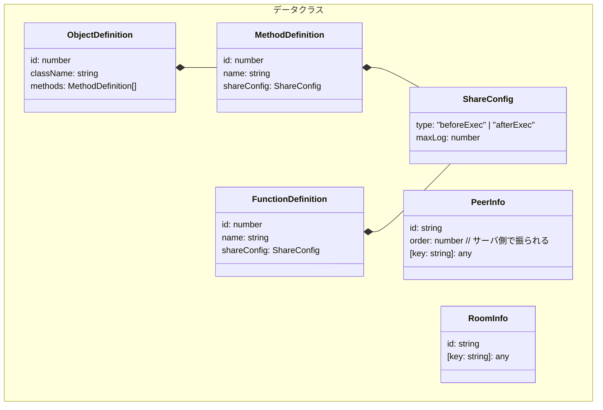
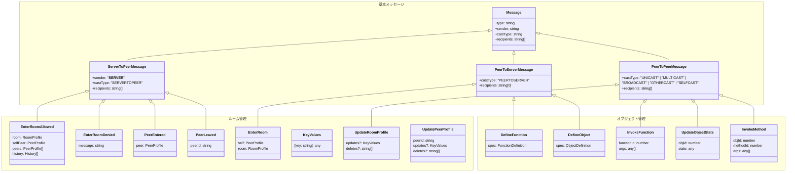
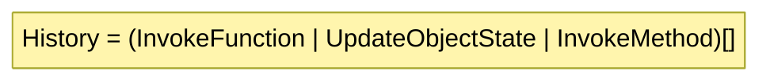

# messages

```mermaid
classDiagram
  namespace データクラス {
    class ShareConfig{
      type: "beforeExec" | "afterExec"
      maxLog: number
    }
    class PeerInfo{
      id: string
      order: number  // サーバ側で振られる
      [key: string]: any
    }
    class RoomInfo{
      id: string
      [key: string]: any
    }
    class FunctionDefinition{
      id: number
      name: string
      shareConfig: ShareConfig
    }
    class MethodDefinition{
      id: number
      name: string
      shareConfig: ShareConfig
    }
    class ObjectDefinition{
      id: number
      className: string
      methods: MethodDefinition[]
    }
  }
  ObjectDefinition*--MethodDefinition
  MethodDefinition*--ShareConfig
  FunctionDefinition*--ShareConfig
```

```mermaid
classDiagram
  namespace 基本メッセージ {
    class Message{
      +type: string
      +sender: string
      +castType: string
      +recipients: string[]
    }
    class PeerToServerMessage{
      +castType: "PEERTOSERVER"
      +recipients: string[0]
    }
    class ServerToPeerMessage{
      +sender: "__SERVER__"
      +castType: "SERVERTOPEER"
      +recipients: string[]
    }
    class PeerToPeerMessage{
      +castType: "UNICAST" | "MULTICAST" |
       "BROADCAST" | "OTHERCAST" | "SELFCAST"
      +recipients: string[]
    }
  }
  Message<|--PeerToServerMessage
  Message<|--ServerToPeerMessage
  Message<|--PeerToPeerMessage
  namespace ルーム管理{
    class EnterRoomAllowed {
      room: RoomProfile
      selfPeer: PeerProfile
      peers: PeerProfile[]
      history: History[]
    }
    class EnterRoomDenied {
      message: string
    }
    class PeerEntered {
      peer: PeerProfile
    }
    class PeerLeaved{
      peerId: string
    }
    class EnterRoom {
      self: PeerProfile
      room: RoomProfile
    }
    class KeyValues{
      [key: string]: any
    }
    class UpdateRoomProfile{
      updates?: KeyValues
      deletes?: string[]
    }
    class UpdatePeerProfile{
      peerId: string
      updates?: KeyValues
      deletes?: string[]
    }
  }
  PeerToServerMessage<|--EnterRoom 
  ServerToPeerMessage<|--EnterRoomAllowed
  ServerToPeerMessage<|--EnterRoomDenied
  PeerToPeerMessage<|--UpdateRoomProfile 
  ServerToPeerMessage<|--PeerEntered
  ServerToPeerMessage<|--PeerLeaved
  namespace オブジェクト管理{
    class DefineFunction{
      spec: FunctionDefinition
    }
    class DefineObject{
      spec: ObjectDefinition
    }
    class InvokeFunction{
      functionId: number
      args: any[]
    }
    class UpdateObjectState{
      objId: number
      state: any
    }
    class InvokeMethod{
      objId: number
      methodId: number
      args: any[]
    }
  }
  PeerToServerMessage<|--DefineFunction
  PeerToPeerMessage<|--InvokeFunction
  PeerToServerMessage<|--DefineObject
  PeerToPeerMessage<|--UpdateObjectState
  PeerToPeerMessage<|--InvokeMethod
```

```mermaid
classDiagram
  note "History = (InvokeFunction | UpdateObjectState | InvokeMethod)[]"
```
