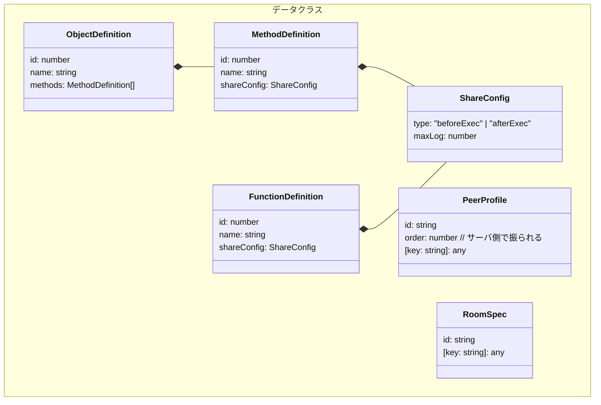
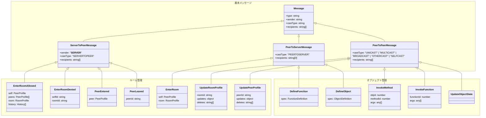
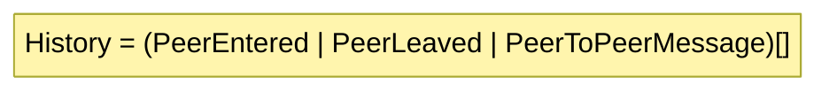
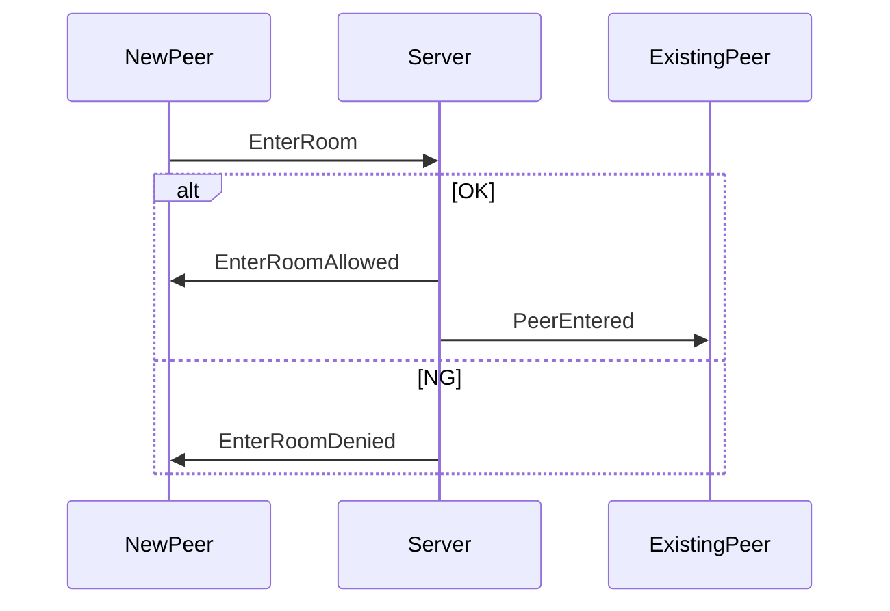
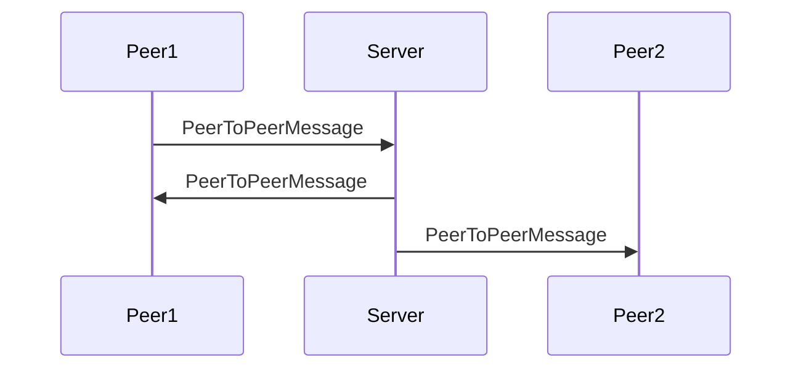
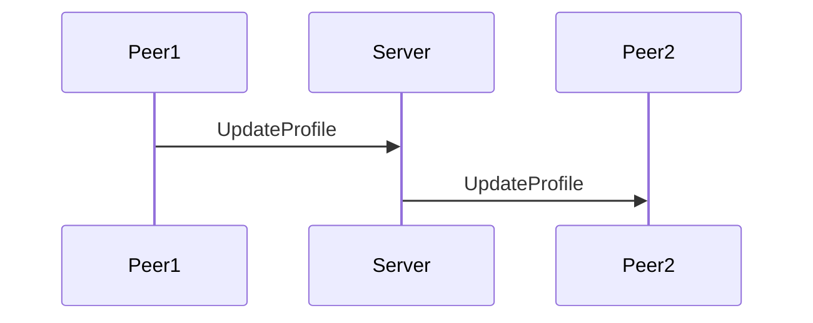
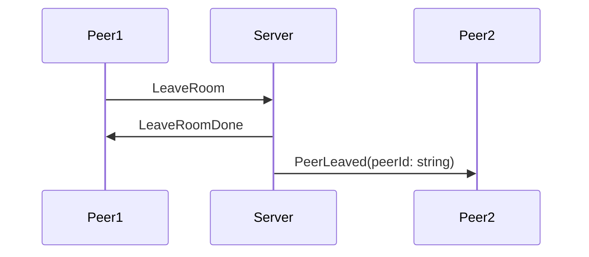
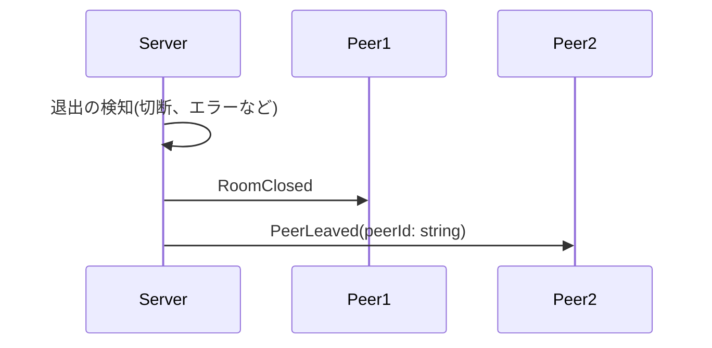
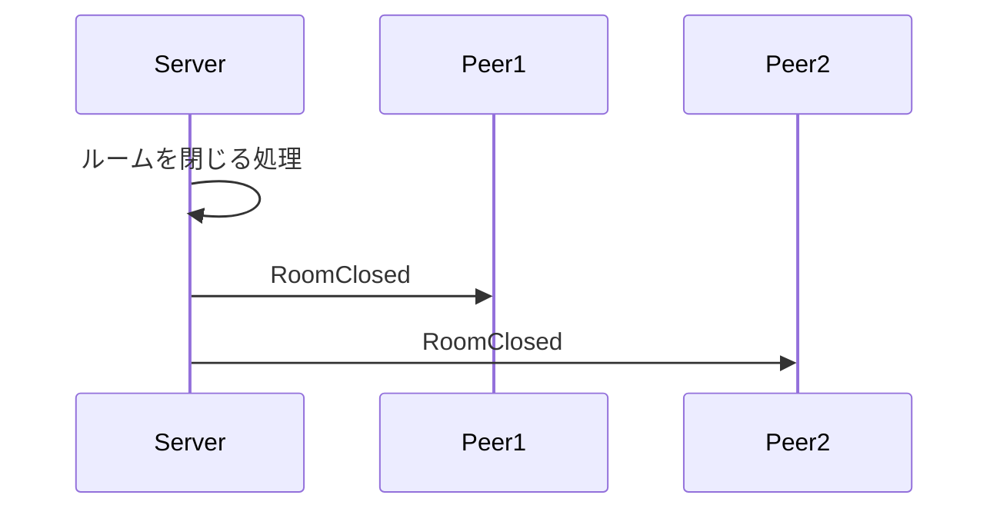
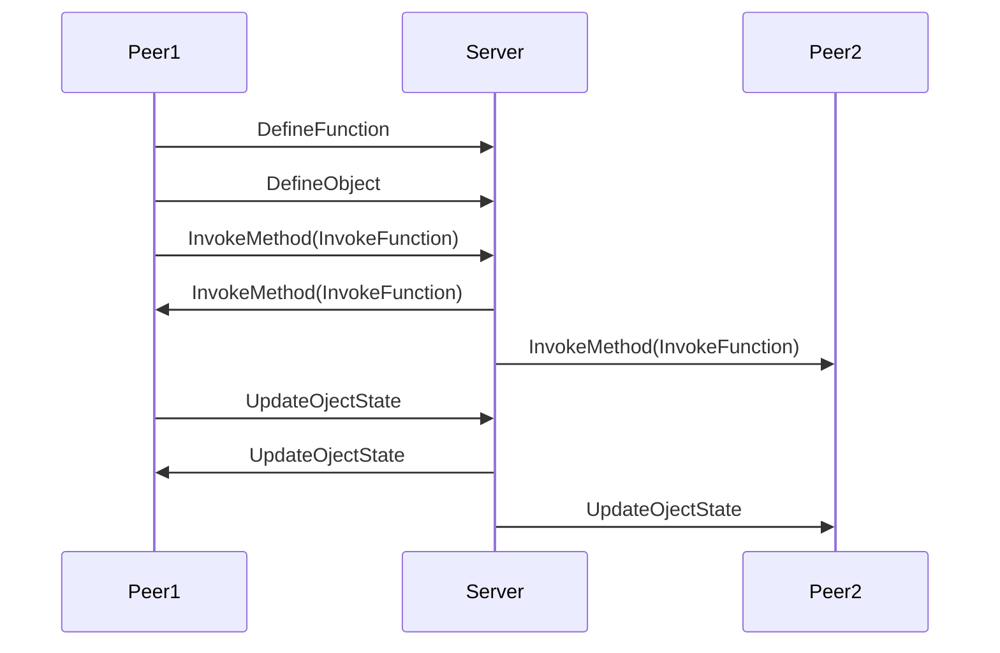

# madoi-core

次バージョンでの整理

分散共有オブジェクトフレームワーク 'madoi' のコア部分。メッセージ配信処理のみを実装。

## 用語
|用語|説明|
|---|---|
|メッセージ(Message)|クライアントやサーバ間でやりとりされるデータ。JSON形式|
|ピア(Peer)|クライアントを識別する単位。IDとプロファイル(name=valueのセット)を持ち、ルームに参加してメッセージ通信を行う|
|サーバ(Server)|ピアが接続する対象。複数のピアとルームを管理し、ルーム内でのメッセージ配信を実現する|
|ルーム(Room)|ピアが参加する、メッセージ配信の区切りとなるグループ。|

## 基本メッセージ定義

##　同期機能
* オブジェクトリビジョン管理？
  * オブジェクトのリビジョン(メソッド呼び出しのたびに+1)を管理する。
  * 何が嬉しい？リビジョンの不整合が検出できる。
  * 不整合
    * サーバがInvokeMethodを受け取った時、前提とするオブジェクトのリビジョンとサーバ内のオブジェクトのリビジョンが違う
    * ピアがInvokeMethodを受け取った時、前提とするオブジェクトのリビジョンとピア内のオブジェクトのリビジョンが違う
  * 不整合を検出したらどうする？
    * PeerにInvokeMethod失敗を通知する？
* 同期
  * Eventual Consistencyは必須
  * j???

## ルーム管理

### メッセージ定義

### 入室時メッセージシーケンス

### 入室後
#### ピア同士の通信

#### プロファイル変更

### 退室時
#### Peerからの退室通知

#### サーバ側での退室処理

#### サーバ側のシャットダウン

## オブジェクト管理メッセージシーケンス

### 入室後
