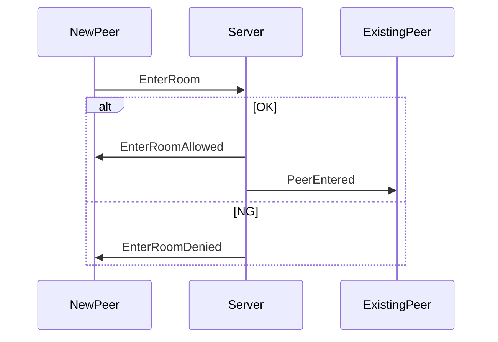
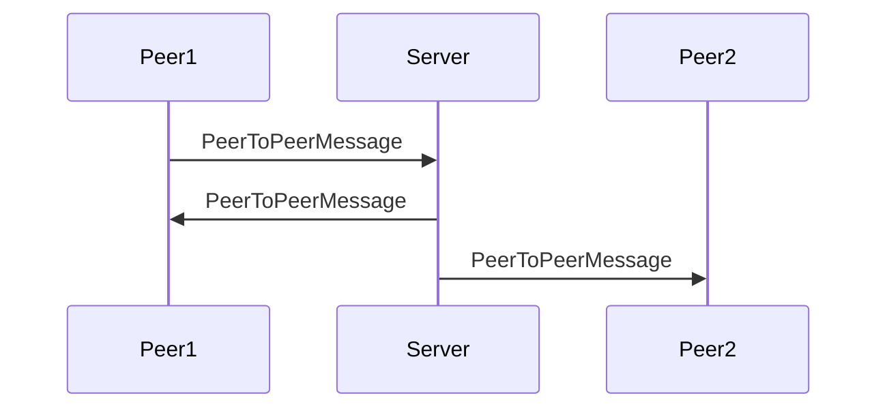
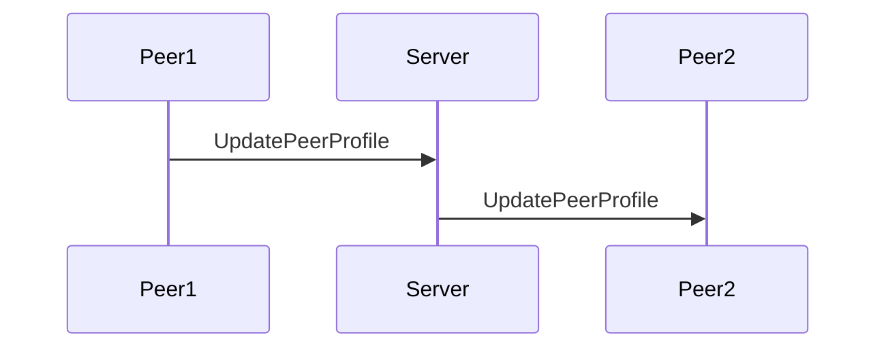
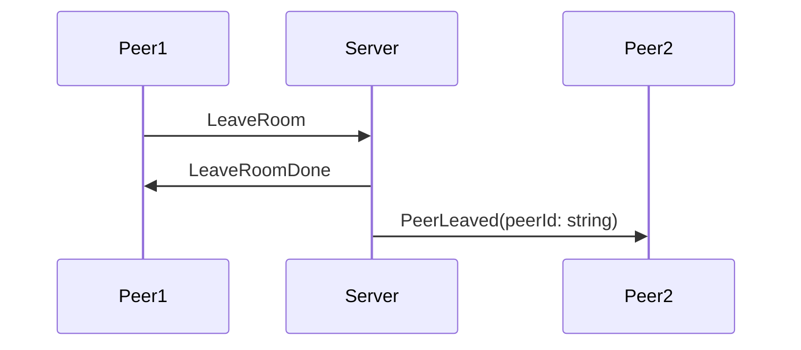
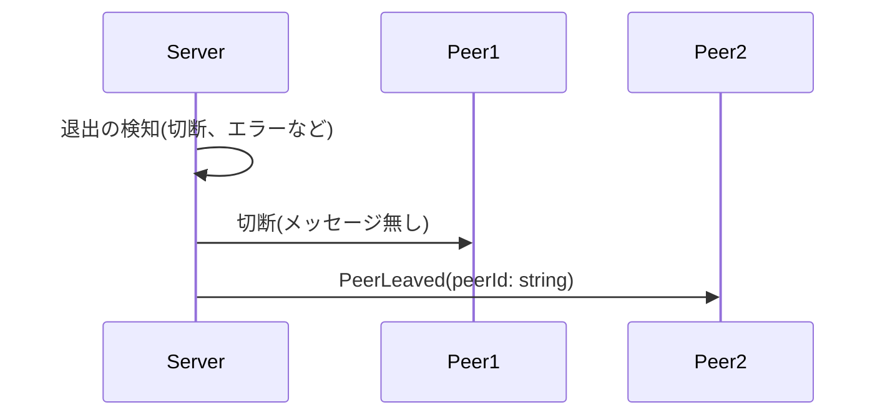
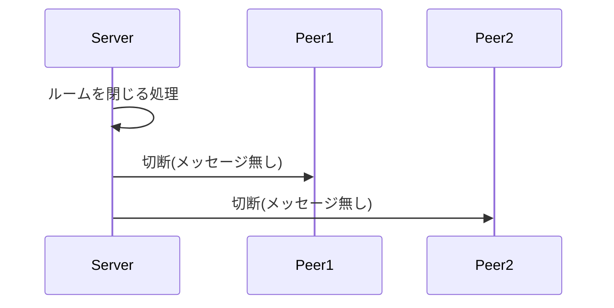
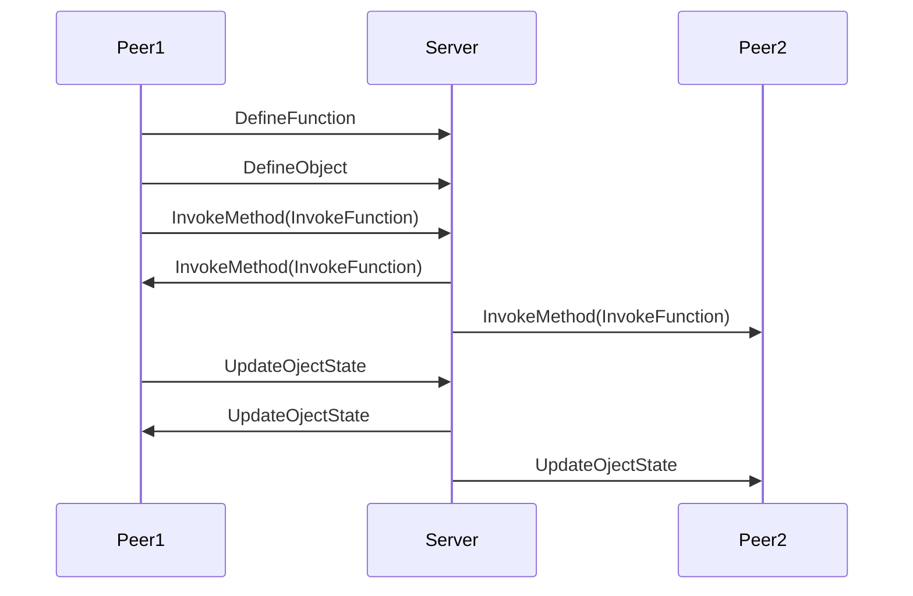

# sequences

## 入室

```mermaid
sequenceDiagram
  NewPeer->>Server: EnterRoom
  alt OK
    Server->>NewPeer: EnterRoomAllowed
    Server->>ExistingPeer: PeerEntered
  else NG
    Server->>NewPeer: EnterRoomDenied
  end
```

## 入室後
### ピア同士の通信

```mermaid
sequenceDiagram
  Peer1->>Server: PeerToPeerMessage
  Server->>Peer1: PeerToPeerMessage
  Server->>Peer2: PeerToPeerMessage
```
### プロファイル変更

```mermaid
sequenceDiagram
  Peer1->>Server: UpdatePeerProfile
  Server->>Peer2: UpdatePeerProfile
```

## 退室時
### Peerからの退室通知

```mermaid
sequenceDiagram
  Peer1->>Server: LeaveRoom
  Server->>Peer1: LeaveRoomDone
  Server->>Peer2: PeerLeaved(peerId: string)
```

### サーバ側での退室処理

```mermaid
sequenceDiagram
  Server->>Server: 退出の検知(切断、エラーなど)
  Server->>Peer1: 切断(メッセージ無し)
  Server->>Peer2: PeerLeaved(peerId: string)
```

### サーバ側のシャットダウン

```mermaid
sequenceDiagram
  Server->>Server: ルームを閉じる処理
  Server->>Peer1: 切断(メッセージ無し)
  Server->>Peer2: 切断(メッセージ無し)
```

## オブジェクト管理メッセージシーケンス

### 入室後

```mermaid
sequenceDiagram
  Peer1->>Server: DefineFunction
  Peer1->>Server: DefineObject
  Peer1->>Server: InvokeMethod(InvokeFunction)
  Server->>Peer1: InvokeMethod(InvokeFunction)
  Server->>Peer2: InvokeMethod(InvokeFunction)
  Peer1->>Server: UpdateOjectState
  Server->>Peer1: UpdateOjectState
  Server->>Peer2: UpdateOjectState
```